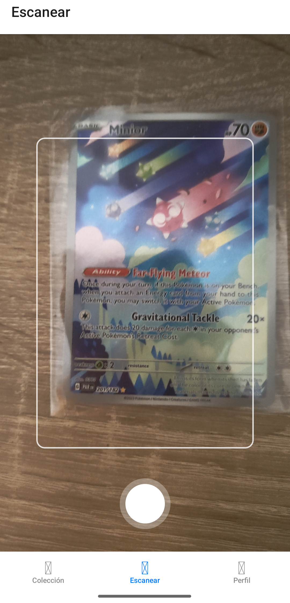
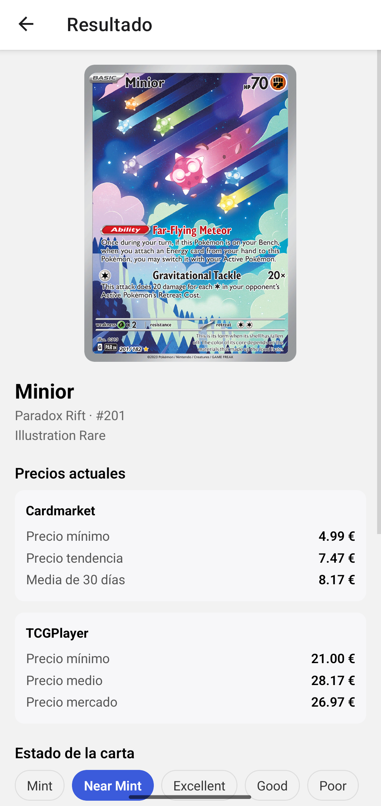
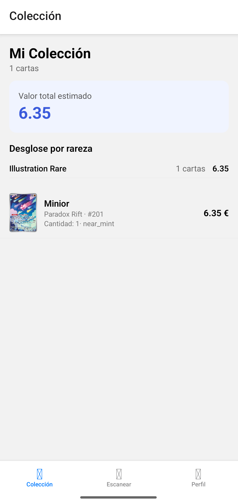

# 🎴 PokéLens - Escáner y Valorador de Cartas Pokémon


App móvil que usa **Inteligencia Artificial** para identificar cartas Pokémon con la cámara y consultar su precio en tiempo real en Cardmarket y TCGPlayer. Gestiona una colección virtual con valoración total desglosada por rareza.

---

## 🚀 Descripción del Proyecto

PokéLens actúa como un valorador de cartas Pokémon en tu bolsillo. Apunta la cámara a cualquier carta, y el sistema la identifica automáticamente usando **Gemini Vision**, consulta su precio en los principales marketplaces y la añade a tu colección personal con un valor estimado según su estado de conservación.

- **Identificación por IA:** Gemini 2.5 Flash analiza la foto y extrae nombre, set, número y rareza de la carta.
- **Precios en tiempo real:** Integración con PokéTCG API que devuelve precios de Cardmarket (EUR) y TCGPlayer (USD).
- **Colección virtual:** Base de datos personal por usuario con valor estimado por condición (Mint, Near Mint, Excellent...) y resumen total desglosado por rareza.
- **Autenticación segura:** Sistema de registro y login con JWT, contraseñas hasheadas con bcrypt y almacenamiento seguro del token en el móvil.

---

## ✨ Funcionalidades Clave

✅ **Escaneo con cámara:** Encuadra la carta, haz foto y la IA la identifica en segundos.  
✅ **Precios Cardmarket y TCGPlayer:** Precio mínimo, tendencia y media de los últimos 30 días.  
✅ **Valor estimado por condición:** Multiplica el precio de mercado según el estado de la carta.  
✅ **Colección con totales:** Valor total de la colección y desglose por rareza (Common, Rare, Ultra Rare...).  
✅ **Detalle por carta:** Imagen oficial, precios actualizados, estado y opción de eliminar.  
✅ **Autenticación:** Registro, login y logout con JWT. Cada usuario ve solo su colección.  
✅ **Hot Reload:** Cambios en el código del frontend se reflejan en el móvil en tiempo real.

---

## 📸 Galería

### 📷 Escaneo con Cámara
Apunta a cualquier carta y Gemini Vision identifica nombre, set, número y rareza en segundos.


### 💰 Resultado e Identificación
Imagen oficial de la carta con precios en tiempo real de Cardmarket (EUR) y TCGPlayer (USD), y selector de condición para añadirla a tu colección.


### 📦 Colección Personal
Valor total de tu colección y desglose por rareza: Common, Rare, Ultra Rare y más.


---

## 🏗️ Arquitectura del Sistema

```text
[ App Móvil - Expo Go ]
          │
          │ foto + JWT
          ▼
[ POST /scan ]
          │
          ▼
[ Gemini 2.5 Flash ] ──► nombre, set, número, rareza
          │
          ▼
[ PokéTCG API ] ──► imagen oficial + precios Cardmarket / TCGPlayer
          │
          ▼
[ Pantalla Resultado ] ──► usuario elige estado y cantidad
          │
          ▼
[ POST /collection ] ──► guarda en SQLite vinculada al usuario
          │
          ▼
[ GET /collection ] ──► valor total + desglose por rareza
```

---

## 📂 Estructura del Proyecto

```text
pokelens/
├── backend/                     # 🐍 API REST con FastAPI
│   ├── app/
│   │   ├── main.py              # Entrypoint, registra routers
│   │   ├── config.py            # Variables de entorno
│   │   ├── database.py          # SQLAlchemy engine/session
│   │   ├── models/              # ORM: Card, User, UserCard
│   │   ├── schemas/             # Pydantic: CardResult, UserCardOut...
│   │   ├── routers/             # Endpoints: auth, scan, collection, prices
│   │   ├── services/            # Lógica: vision_ai, pokemontcg, price_aggregator
│   │   └── core/                # JWT y bcrypt: security.py, deps.py
│   ├── requirements.txt
│   ├── .env.example
│   └── README.md
│
└── mobile/                      # 📱 App Expo (React Native + TypeScript)
    ├── app/
    │   ├── _layout.tsx          # Stack raíz + redirección según auth
    │   ├── login.tsx            # Pantalla login/registro
    │   ├── scan-result.tsx      # Resultado del escaneo + añadir a colección
    │   ├── (tabs)/
    │   │   ├── index.tsx        # Colección con resumen y lista
    │   │   ├── scan.tsx         # Cámara + escaneo
    │   │   └── profile.tsx      # Perfil + logout
    │   └── card/[id].tsx        # Detalle de carta
    ├── components/              # CameraView, CardListItem, PriceBreakdown...
    ├── hooks/                   # useScanCard, useCollection
    ├── services/                # api.ts, authService, scanService, collectionService
    ├── types/                   # card.ts
    ├── package.json
    └── .env.example
```

---

## ⚙️ Instalación y Uso

### Requisitos previos

- Python 3.12+
- Node.js 20+
- App **Expo Go** instalada en el móvil ([Android](https://play.google.com/store/apps/details?id=host.exp.exponent) / [iOS](https://apps.apple.com/app/expo-go/id982107779))
- API key de Gemini (gratis en https://aistudio.google.com/app/apikey)

### 1. Backend

```bash
cd backend
python -m venv venv
source venv/bin/activate        # Windows: venv\Scripts\activate
pip install -r requirements.txt
cp .env.example .env
# Edita .env con tus API keys
python -m uvicorn app.main:app --reload --host 0.0.0.0
```

Verifica en http://localhost:8000/docs

### 2. Mobile

```bash
cd mobile
npm install --legacy-peer-deps
cp .env.example .env
# Edita .env con tu IP local (hostname -I)
npx expo start
```

Escanea el QR con Expo Go (móvil en la misma WiFi que el PC).

---

## 🧪 Variables de Entorno

- `backend/.env`
- `GEMINI_API_KEY=tu_api_key`           # https://aistudio.google.com/app/apikey
- `POKEMONTCG_API_KEY=tu_api_key`       # https://dev.pokemontcg.io (opcional)
- `DATABASE_URL=sqlite:///./pokelens.db`
- `SECRET_KEY=genera_con_secrets.token_hex(32)`
- `mobile/.env`
- `EXPO_PUBLIC_API_URL=http://TU_IP_LOCAL:8000`

---

## 🛠️ Stack Tecnológico

| Capa | Tecnología |
|------|-----------|
| IA Visión | Google Gemini 2.5 Flash |
| Datos de cartas y precios | PokéTCG API |
| Backend | FastAPI + SQLAlchemy + SQLite |
| Autenticación | JWT (python-jose) + bcrypt (passlib) |
| App móvil | Expo SDK 54 + React Native + TypeScript |
| Navegación | Expo Router (file-based routing) |
| Token seguro | expo-secure-store |

---

## 📓 Notas de Desarrollo

PokéLens combina **visión artificial** (Gemini Vision) para la identificación de cartas con una **API de datos especializada** (PokéTCG) para precios y metadatos. Este enfoque híbrido evita tener que mantener una base de datos propia de cartas y aprovecha los precios actualizados del marketplace.

El sistema está diseñado para evolucionar: la capa de servicios del backend (`services/`) permite sustituir fácilmente Gemini por otro modelo de visión, y añadir scraping directo de Cardmarket para precios aún más frescos cuando el volumen lo justifique.

**build:** versión 1.0.0
